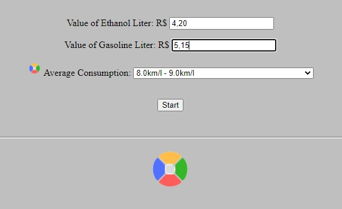

<h3 align="center"> 

</h3>

<h1 align="center">
   ⛽ <a href="#"> GASOLVE </a>
</h1>

<h3 align="center">
    Personal fill up assistant 
</h3>


<p align="center">
  
  
  
  
  <a href="https://github.com/vitoriape/gasolve/blob/main/LICENSE">
    
  </a>
  
  <a href="https://github.com/vitoriape/gasolve/commits/main">
    
  </a>
</p>

<h4 align="center"> 
	 Status: Update required
</h4>

---

Index
=================
<!--ts-->
   * [About](#about)
   * [Tools](#tools)
   * [References](#references)
   * [Features](#features)
   * [Layout](#layout)
   * [Pre-requisites](#pre-requisites)
   * [Setup](#setup)
   * [Team](#team)

## About
Este projeto é uma ferramenta desenvolvida para auxiliar o usuário na escolha entre gasolina e etanol para abastecimento. O script em [HTML/JavaScript](https://developer.mozilla.org/pt-BR/) compara informações de valor dos combustíveis.

## Tools
Development of this template utilizes the tools listed below:

- [Git](https://git-scm.com/)
- [Visual Studio Code](https://code.visualstudio.com/docs)
- [HTML](https://developer.mozilla.org/pt-BR/docs/Web/HTML)
- [JavaScript](https://developer.mozilla.org/pt-BR/docs/Web/JavaScript)

## References
For more information about HTML forms, check out the [tutorials](https://www.w3schools.com/html/html_forms.asp) of [W3Schools](https://www.w3schools.com/).

## Features

- [x] HTML Form
- [x] JavaScript scripts for HTML

## Layout
<table class="tg">
<thead>

  <tr>
    <th class="tg-c3ow">Preview</th>
  </tr>
</thead>
<tbody>
  <tr>
    <td class="tg-c3ow"><br></td>
  </tr>
</tbody>
</table>

---

## Pre-requisites
You can use an in-browser IDE like [Replit](https://replit.com/) or [Codeacademy](https://www.codecademy.com/), but for a better experience editing the scripts, consider an advanced source-code editor **(e.g. Visual Studio Code, Eclipse)**.

## Setup
```bash
# Clone this repository
$ git clone <https://github.com/vitoriape/gasolve>

# Access the project folder
$ cd gasolve


# First Option: Open the file gasolve.html for editing the complete project
$ start gasolve.html

# Second Option: Open the folder script-only to edit it separately
$ cd script
$ start gasolveForm.js

# Third Option: Open the folder html-only to edit it separately
$ cd html form
$ start gasolve.html
```

---

## Team
### Author

<table>
  <tr>
    <td align="center"><a href="https://github.com/vitoriape"><br /><sub><b>Vitória Peçanha</b></sub></a><br /><a href="https://www.linkedin.com/in/vitoria-pecanha/" title="LinkedIn">🌐</a>   <a href="mailto:vitoriapecanha.log@gmail.com" title="E-mail">📬</a>   <a href="https://translate.habitica.com/user/PenariaToji/" title="Linguists Commonwealth">📜</a></td>   
</table>


### License

This project is under the   
<a href="https://github.com/vitoriape/gasolve/blob/main/LICENSE">
    
</a>